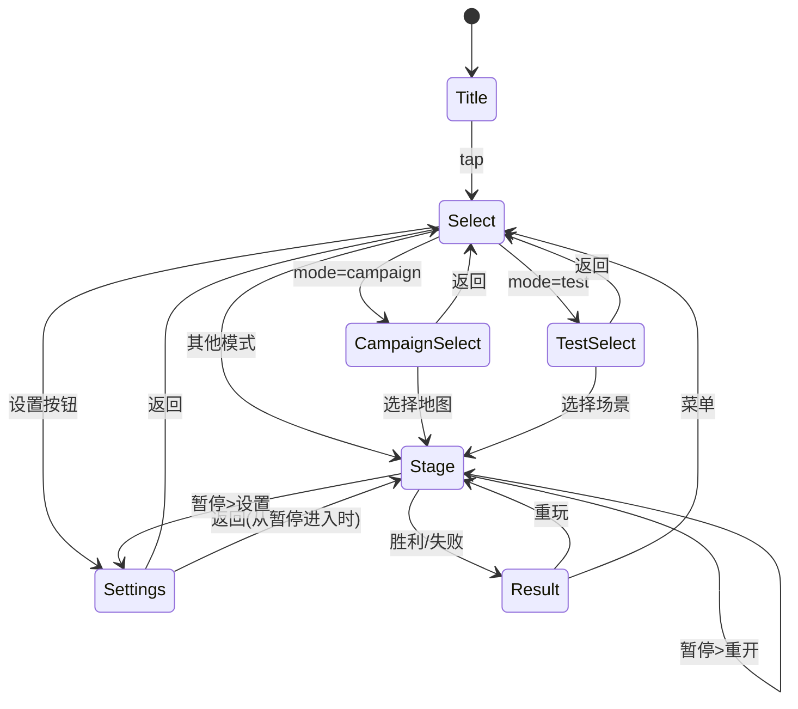
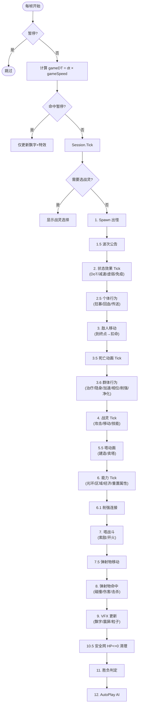
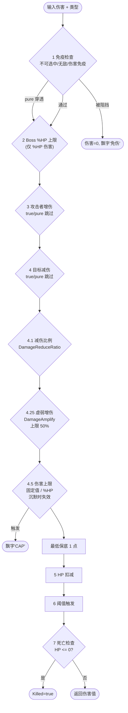
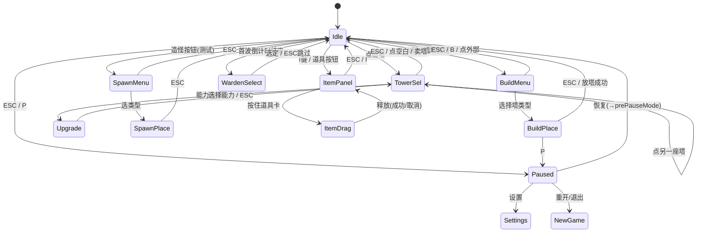
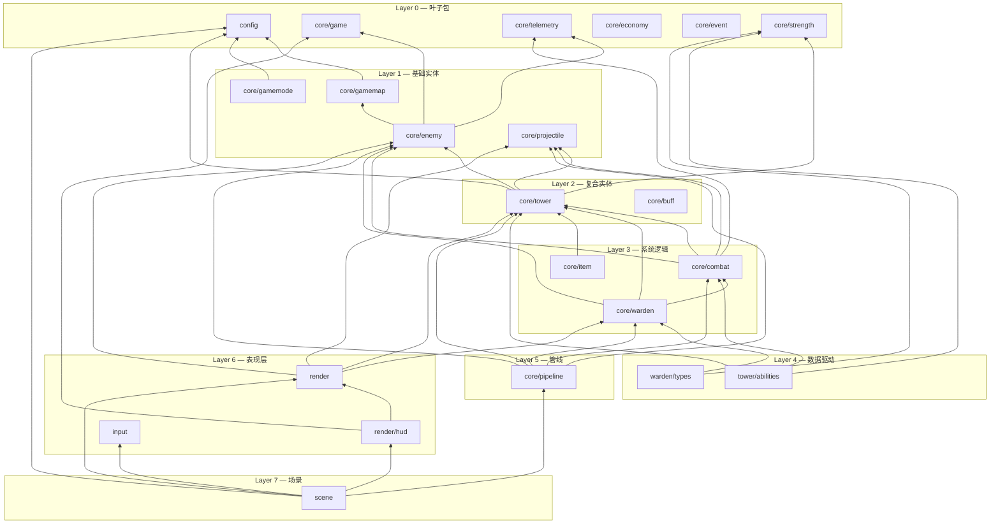
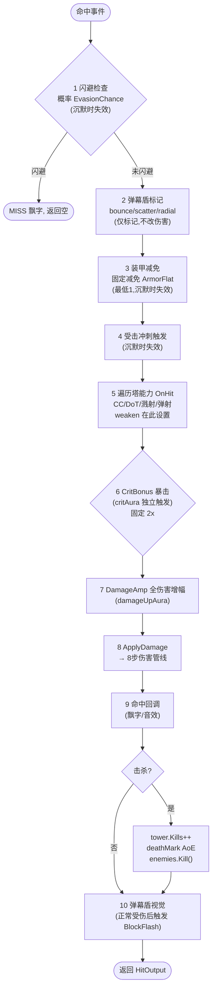

# 项目架构全览

> 所有图表使用 Mermaid 语法，GitHub / VSCode 原生渲染。

---

## 1. 场景流

---

## 2. 每帧 Tick 管线（updatePlaying）

---

## 3. 伤害管线（ApplyDamage 8 步）

---

## 4. 交互状态机（11 模式）

---

## 5. 包依赖层次

---

## 6. ApplyHit 命中处理流程

