# Visual Review Manifest

> 使用方法: 将本文件和同目录的截图一起发给 Claude Vision，
> 让它逐张按检查项回答 Yes/No 并标记发现的问题。

共 37 张截图待审查。

## 敌人外观 (18)

### enemy_normal.png
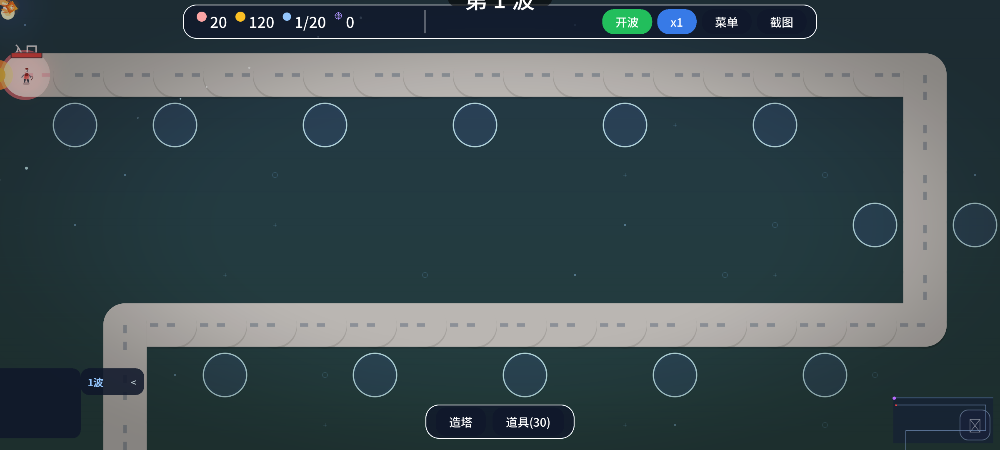

**场景**: 敌人原型 'normal' 首次出现时的行走状态

**检查项**:
1. 敌人是否渲染为正常的精灵图像（而非占位符）？
2. 敌人是否处于正常的行走动画帧（而非 hit/受击 帧）？ _(ref: 怪物出现就播 hit 帧)_
3. 敌人周围是否有异常的白色方框/光晕？ _(ref: hit帧白方框)_
4. 敌人的血条是否正常显示在头顶？

### enemy_dying.png
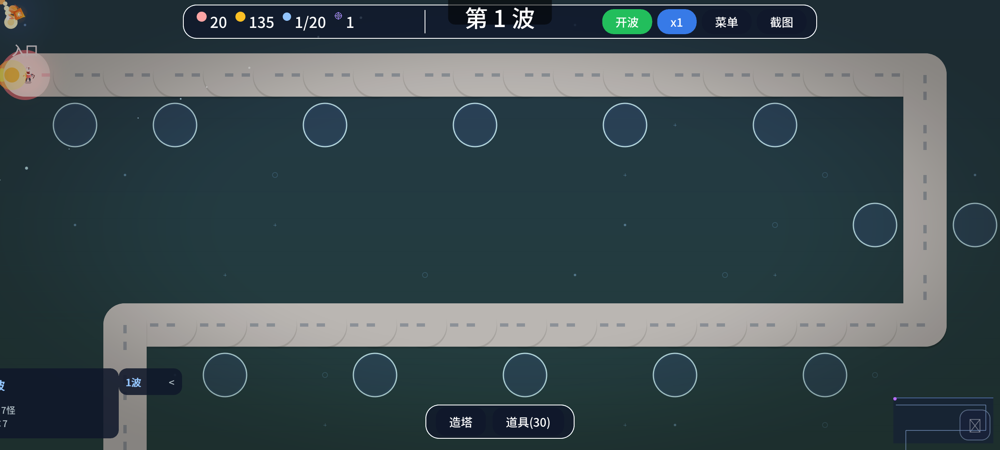

**场景**: 敌人原型 'dying' 首次出现时的行走状态

**检查项**:
1. 敌人是否渲染为正常的精灵图像（而非占位符）？
2. 敌人是否处于正常的行走动画帧（而非 hit/受击 帧）？ _(ref: 怪物出现就播 hit 帧)_
3. 敌人周围是否有异常的白色方框/光晕？ _(ref: hit帧白方框)_
4. 敌人的血条是否正常显示在头顶？

### enemy_swarm.png
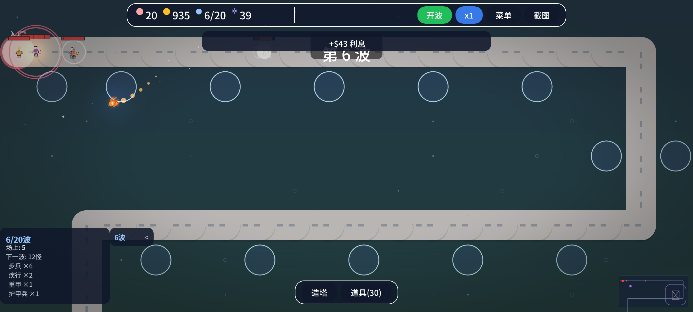

**场景**: 敌人原型 'swarm' 首次出现时的行走状态

**检查项**:
1. 敌人是否渲染为正常的精灵图像（而非占位符）？
2. 敌人是否处于正常的行走动画帧（而非 hit/受击 帧）？ _(ref: 怪物出现就播 hit 帧)_
3. 敌人周围是否有异常的白色方框/光晕？ _(ref: hit帧白方框)_
4. 敌人的血条是否正常显示在头顶？

### enemy_runner.png
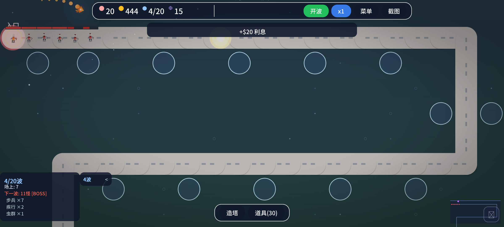

**场景**: 敌人原型 'runner' 首次出现时的行走状态

**检查项**:
1. 敌人是否渲染为正常的精灵图像（而非占位符）？
2. 敌人是否处于正常的行走动画帧（而非 hit/受击 帧）？ _(ref: 怪物出现就播 hit 帧)_
3. 敌人周围是否有异常的白色方框/光晕？ _(ref: hit帧白方框)_
4. 敌人的血条是否正常显示在头顶？

### boss_wave_5.png
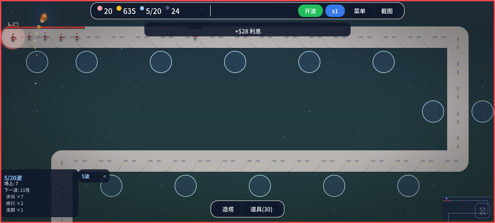

**检查项**:
1. 敌人是否渲染为正常的精灵图像（而非占位符）？
2. 敌人是否处于正常的行走动画帧（而非 hit/受击 帧）？ _(ref: 怪物出现就播 hit 帧)_
3. 敌人周围是否有异常的白色方框/光晕？ _(ref: hit帧白方框)_
4. 敌人的血条是否正常显示在头顶？

### enemy_tank.png

**场景**: 敌人原型 'tank' 首次出现时的行走状态

**检查项**:
1. 敌人是否渲染为正常的精灵图像（而非占位符）？
2. 敌人是否处于正常的行走动画帧（而非 hit/受击 帧）？ _(ref: 怪物出现就播 hit 帧)_
3. 敌人周围是否有异常的白色方框/光晕？ _(ref: hit帧白方框)_
4. 敌人的血条是否正常显示在头顶？

### boss_appear.png
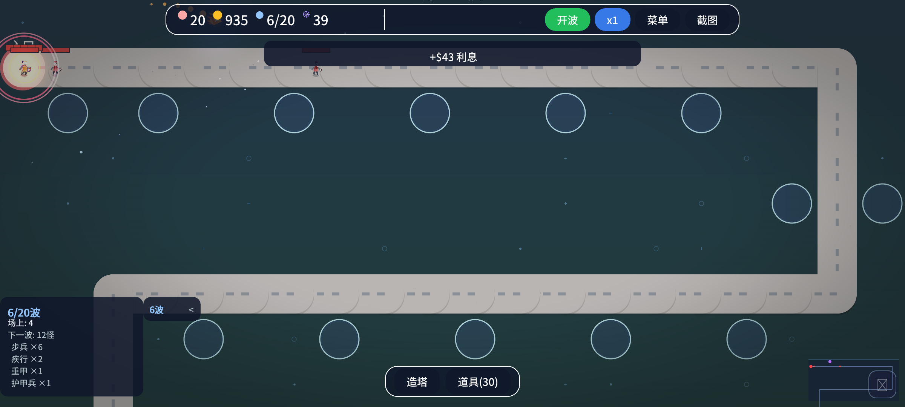

**场景**: Boss 敌人首次出现的画面

**检查项**:
1. 敌人是否渲染为正常的精灵图像（而非占位符）？
2. 敌人是否处于正常的行走动画帧（而非 hit/受击 帧）？ _(ref: 怪物出现就播 hit 帧)_
3. 敌人周围是否有异常的白色方框/光晕？ _(ref: hit帧白方框)_
4. 敌人的血条是否正常显示在头顶？
5. Boss 敌人是否体型明显大于普通敌人？
6. Boss 是否有独特的视觉标识（颜色/光环）？

### enemy_armored.png
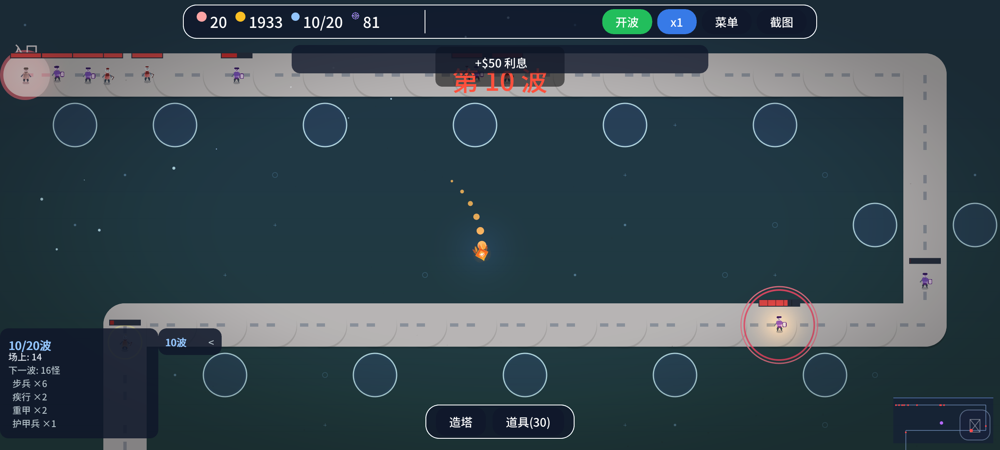

**场景**: 敌人原型 'armored' 首次出现时的行走状态

**检查项**:
1. 敌人是否渲染为正常的精灵图像（而非占位符）？
2. 敌人是否处于正常的行走动画帧（而非 hit/受击 帧）？ _(ref: 怪物出现就播 hit 帧)_
3. 敌人周围是否有异常的白色方框/光晕？ _(ref: hit帧白方框)_
4. 敌人的血条是否正常显示在头顶？

### enemy_shielded.png
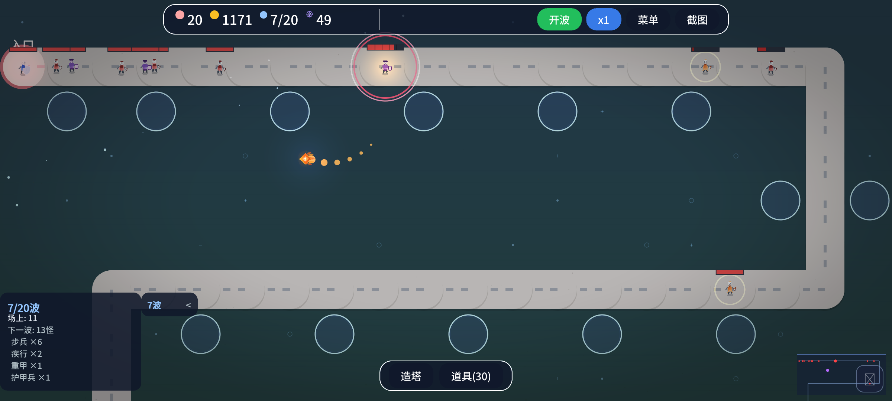

**场景**: 敌人原型 'shielded' 首次出现时的行走状态

**检查项**:
1. 敌人是否渲染为正常的精灵图像（而非占位符）？
2. 敌人是否处于正常的行走动画帧（而非 hit/受击 帧）？ _(ref: 怪物出现就播 hit 帧)_
3. 敌人周围是否有异常的白色方框/光晕？ _(ref: hit帧白方框)_
4. 敌人的血条是否正常显示在头顶？

### boss_wave_10.png
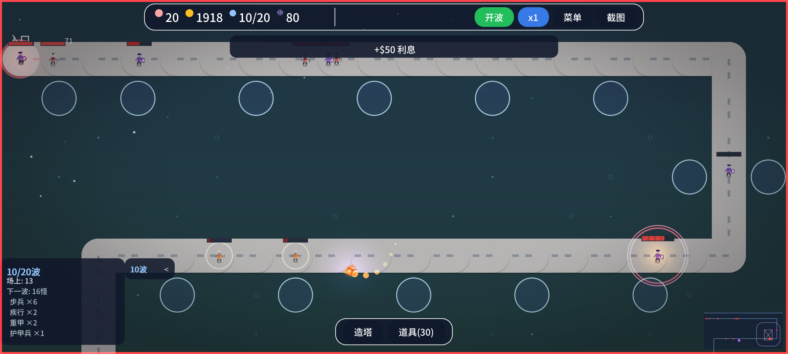

**检查项**:
1. 敌人是否渲染为正常的精灵图像（而非占位符）？
2. 敌人是否处于正常的行走动画帧（而非 hit/受击 帧）？ _(ref: 怪物出现就播 hit 帧)_
3. 敌人周围是否有异常的白色方框/光晕？ _(ref: hit帧白方框)_
4. 敌人的血条是否正常显示在头顶？

### enemy_flying.png
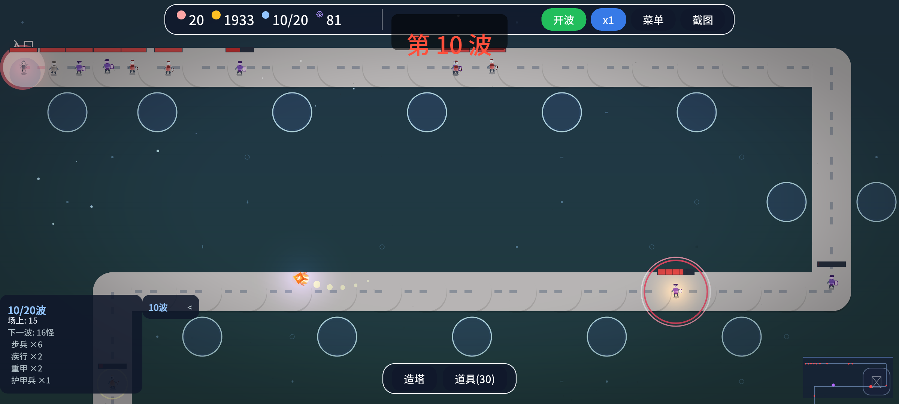

**场景**: 敌人原型 'flying' 首次出现时的行走状态

**检查项**:
1. 敌人是否渲染为正常的精灵图像（而非占位符）？
2. 敌人是否处于正常的行走动画帧（而非 hit/受击 帧）？ _(ref: 怪物出现就播 hit 帧)_
3. 敌人周围是否有异常的白色方框/光晕？ _(ref: hit帧白方框)_
4. 敌人的血条是否正常显示在头顶？

### enemy_healer.png
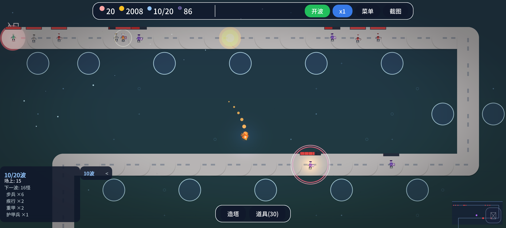

**场景**: 敌人原型 'healer' 首次出现时的行走状态

**检查项**:
1. 敌人是否渲染为正常的精灵图像（而非占位符）？
2. 敌人是否处于正常的行走动画帧（而非 hit/受击 帧）？ _(ref: 怪物出现就播 hit 帧)_
3. 敌人周围是否有异常的白色方框/光晕？ _(ref: hit帧白方框)_
4. 敌人的血条是否正常显示在头顶？

### enemy_stealth.png
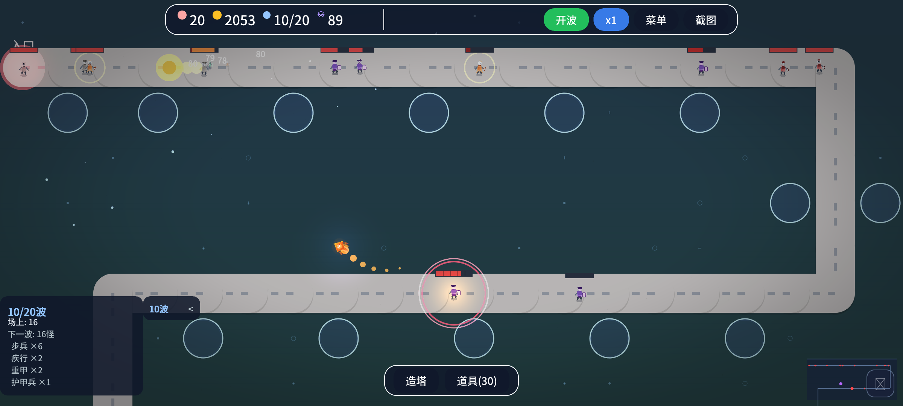

**场景**: 敌人原型 'stealth' 首次出现时的行走状态

**检查项**:
1. 敌人是否渲染为正常的精灵图像（而非占位符）？
2. 敌人是否处于正常的行走动画帧（而非 hit/受击 帧）？ _(ref: 怪物出现就播 hit 帧)_
3. 敌人周围是否有异常的白色方框/光晕？ _(ref: hit帧白方框)_
4. 敌人的血条是否正常显示在头顶？

### boss_wave_15.png
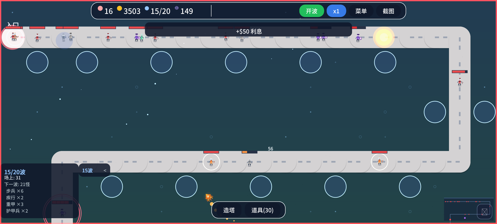

**检查项**:
1. 敌人是否渲染为正常的精灵图像（而非占位符）？
2. 敌人是否处于正常的行走动画帧（而非 hit/受击 帧）？ _(ref: 怪物出现就播 hit 帧)_
3. 敌人周围是否有异常的白色方框/光晕？ _(ref: hit帧白方框)_
4. 敌人的血条是否正常显示在头顶？

### enemy_buffer.png
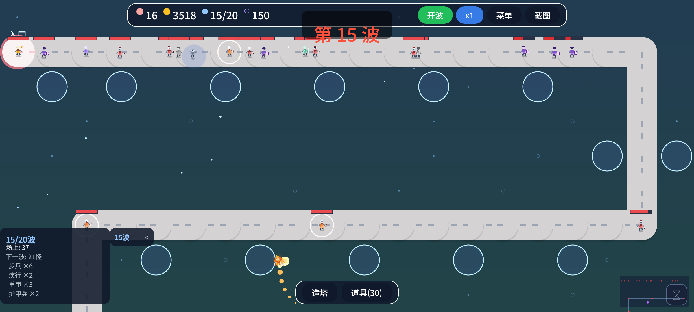

**场景**: 敌人原型 'buffer' 首次出现时的行走状态

**检查项**:
1. 敌人是否渲染为正常的精灵图像（而非占位符）？
2. 敌人是否处于正常的行走动画帧（而非 hit/受击 帧）？ _(ref: 怪物出现就播 hit 帧)_
3. 敌人周围是否有异常的白色方框/光晕？ _(ref: hit帧白方框)_
4. 敌人的血条是否正常显示在头顶？

### enemy_splitter.png
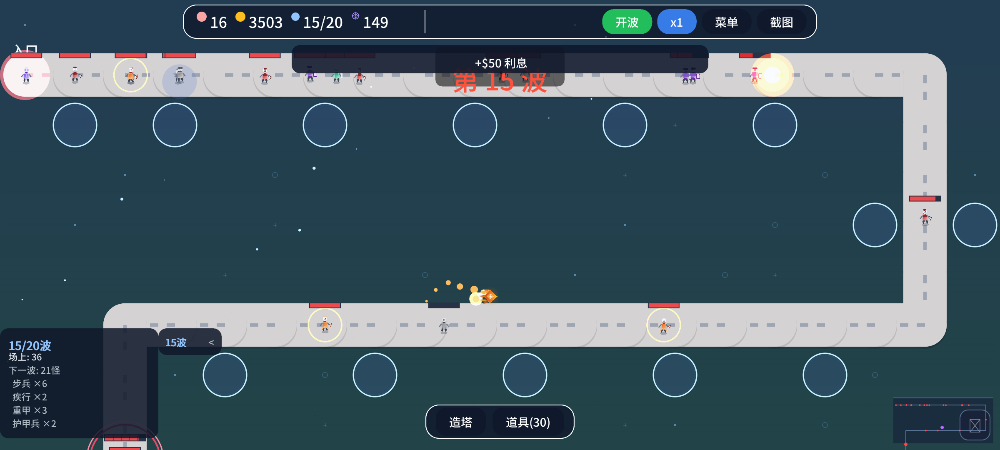

**场景**: 敌人原型 'splitter' 首次出现时的行走状态

**检查项**:
1. 敌人是否渲染为正常的精灵图像（而非占位符）？
2. 敌人是否处于正常的行走动画帧（而非 hit/受击 帧）？ _(ref: 怪物出现就播 hit 帧)_
3. 敌人周围是否有异常的白色方框/光晕？ _(ref: hit帧白方框)_
4. 敌人的血条是否正常显示在头顶？

### enemy_teleporter.png
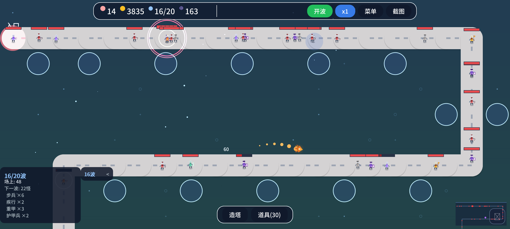

**场景**: 敌人原型 'teleporter' 首次出现时的行走状态

**检查项**:
1. 敌人是否渲染为正常的精灵图像（而非占位符）？
2. 敌人是否处于正常的行走动画帧（而非 hit/受击 帧）？ _(ref: 怪物出现就播 hit 帧)_
3. 敌人周围是否有异常的白色方框/光晕？ _(ref: hit帧白方框)_
4. 敌人的血条是否正常显示在头顶？

### boss_wave_20.png
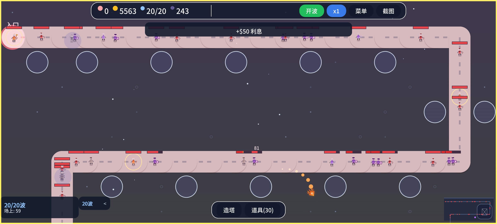

**检查项**:
1. 敌人是否渲染为正常的精灵图像（而非占位符）？
2. 敌人是否处于正常的行走动画帧（而非 hit/受击 帧）？ _(ref: 怪物出现就播 hit 帧)_
3. 敌人周围是否有异常的白色方框/光晕？ _(ref: hit帧白方框)_
4. 敌人的血条是否正常显示在头顶？

## 战灵 (2)

### warden_active.png
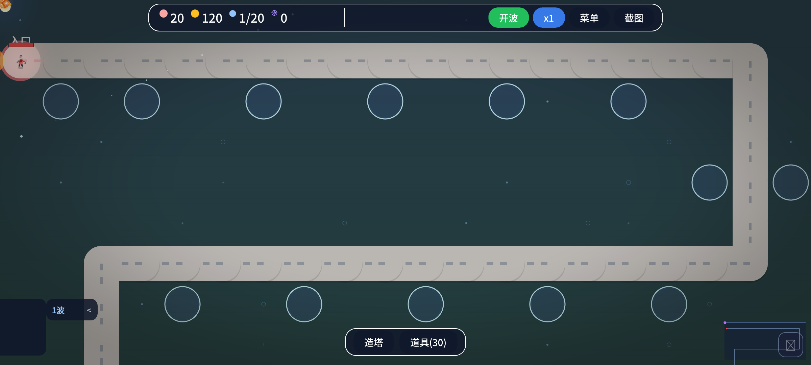

**场景**: 战灵激活后的首次画面

**检查项**:
1. 战灵精灵是否正常渲染（非占位符）？
2. 战灵的朝向是否与其移动方向一致？ _(ref: 战灵朝向不对)_
3. 战灵是否有可见的攻击动画/特效？
4. 战灵是否已离开原点、位于地图上的合理位置？ _(ref: 战灵出生闪现)_

### warden_combat.png
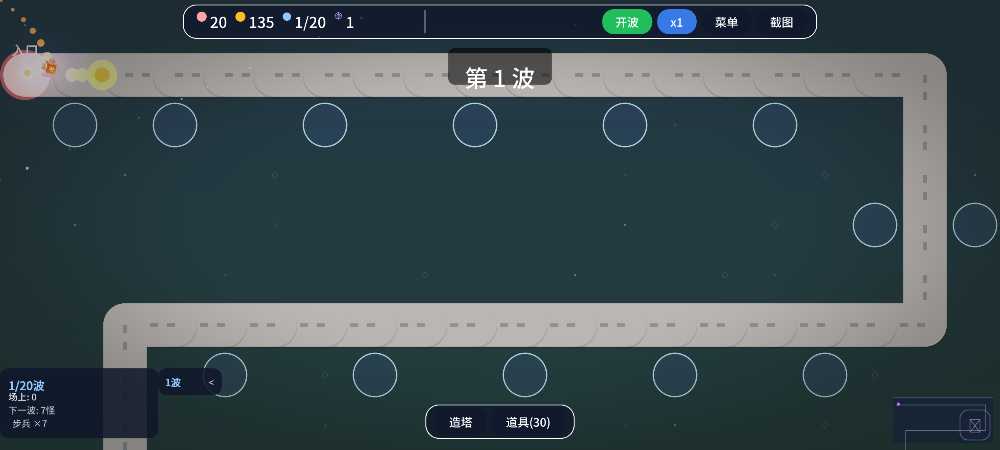

**场景**: 战灵正在战斗中（有敌人在附近）

**检查项**:
1. 战灵精灵是否正常渲染（非占位符）？
2. 战灵的朝向是否与其移动方向一致？ _(ref: 战灵朝向不对)_
3. 战灵是否有可见的攻击动画/特效？

## 场景全局 (17)

### start.png
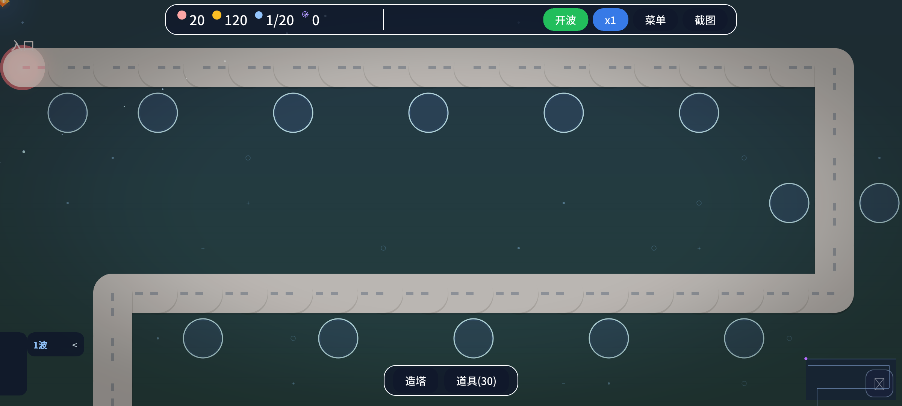

**场景**: 游戏开始画面

**检查项**:
1. 整体画面是否正常渲染（无全黑/全白/严重撕裂）？
2. UI 元素（顶栏、按钮）是否可见且布局正常？

### anomaly_warden_range_limited_x_601.png

**检查项**:
1. 整体画面是否正常渲染（无全黑/全白/严重撕裂）？
2. UI 元素（顶栏、按钮）是否可见且布局正常？

### anomaly_warden_range_limited_y_601.png
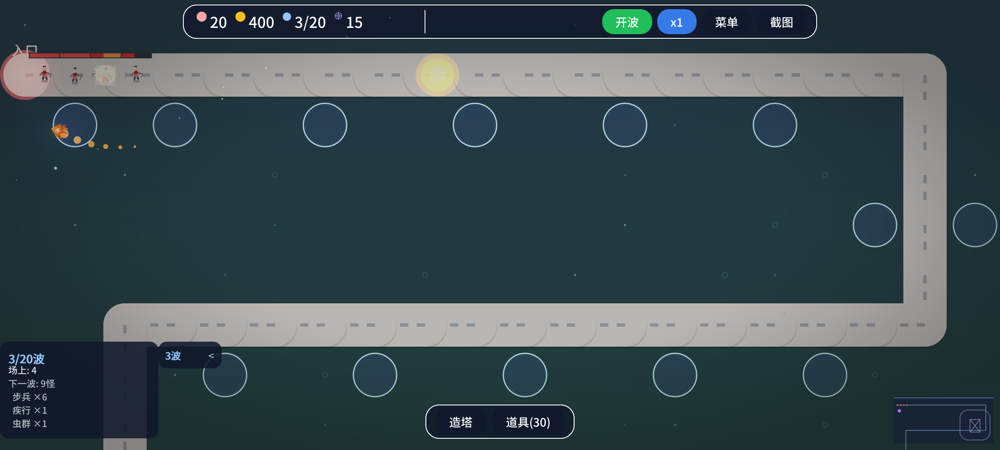

**检查项**:
1. 整体画面是否正常渲染（无全黑/全白/严重撕裂）？
2. UI 元素（顶栏、按钮）是否可见且布局正常？

### leak_wave_12_4585.png
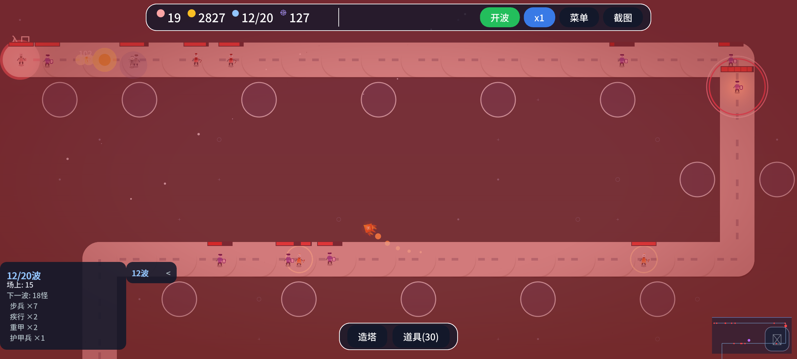

**检查项**:
1. 整体画面是否正常渲染（无全黑/全白/严重撕裂）？
2. UI 元素（顶栏、按钮）是否可见且布局正常？

### leak_wave_15_6203.png
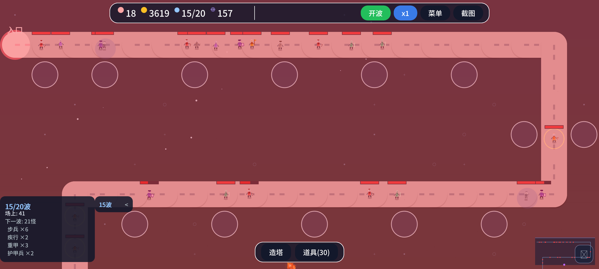

**检查项**:
1. 整体画面是否正常渲染（无全黑/全白/严重撕裂）？
2. UI 元素（顶栏、按钮）是否可见且布局正常？

### leak_wave_15_6281.png
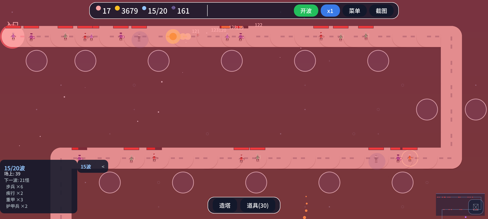

**检查项**:
1. 整体画面是否正常渲染（无全黑/全白/严重撕裂）？
2. UI 元素（顶栏、按钮）是否可见且布局正常？

### leak_wave_15_6384.png
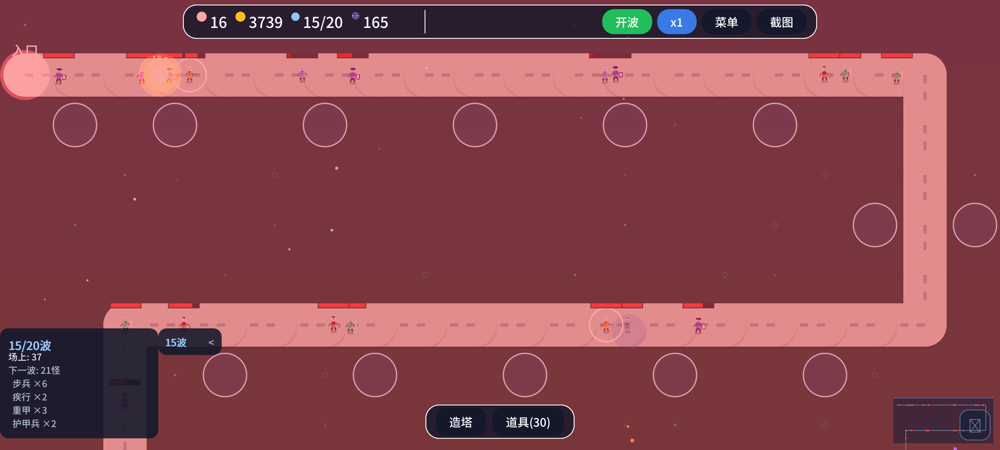

**检查项**:
1. 整体画面是否正常渲染（无全黑/全白/严重撕裂）？
2. UI 元素（顶栏、按钮）是否可见且布局正常？

### leak_wave_16_7099.png
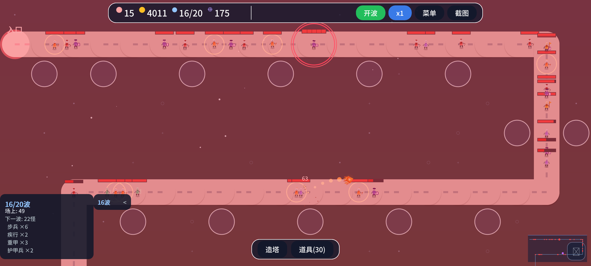

**检查项**:
1. 整体画面是否正常渲染（无全黑/全白/严重撕裂）？
2. UI 元素（顶栏、按钮）是否可见且布局正常？

### leak_wave_16_7244.png
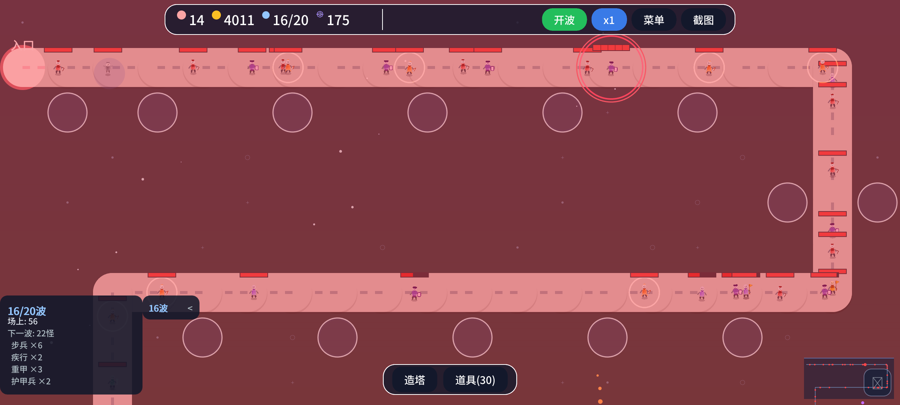

**检查项**:
1. 整体画面是否正常渲染（无全黑/全白/严重撕裂）？
2. UI 元素（顶栏、按钮）是否可见且布局正常？

### leak_wave_17_7540.png
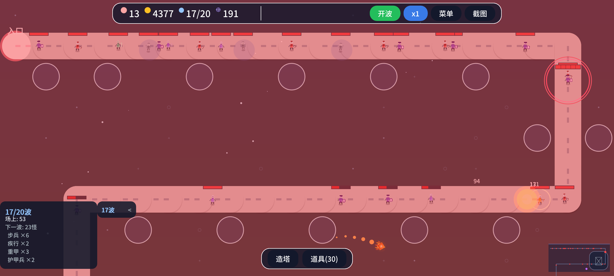

**检查项**:
1. 整体画面是否正常渲染（无全黑/全白/严重撕裂）？
2. UI 元素（顶栏、按钮）是否可见且布局正常？

### leak_wave_17_8059.png
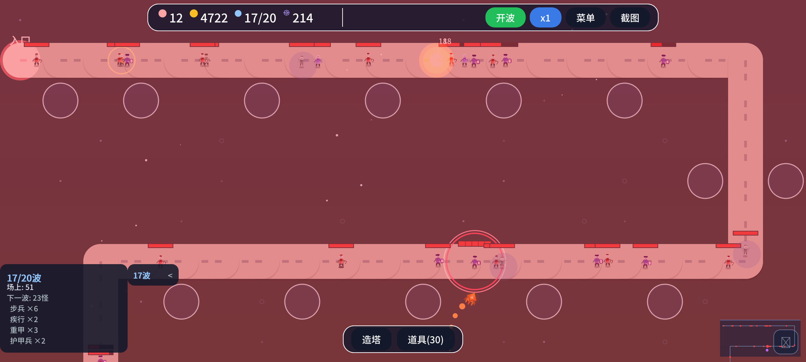

**检查项**:
1. 整体画面是否正常渲染（无全黑/全白/严重撕裂）？
2. UI 元素（顶栏、按钮）是否可见且布局正常？

### leak_wave_18_8161.png
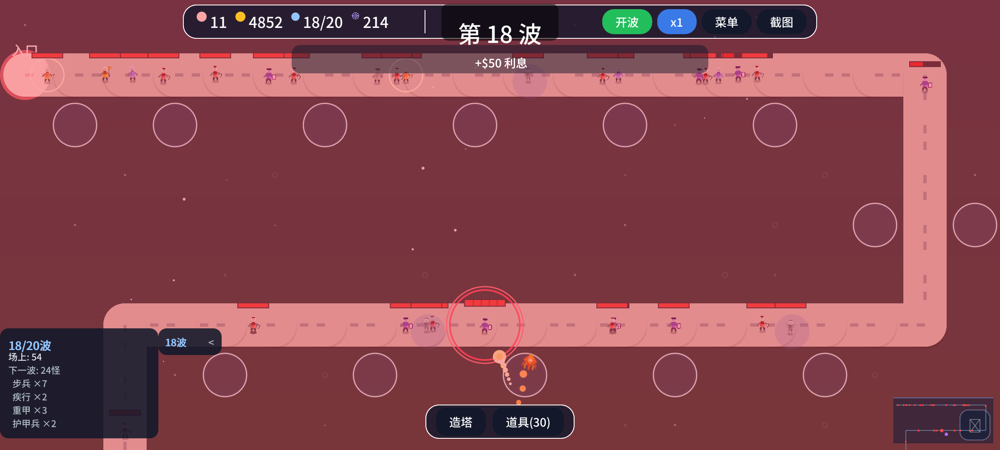

**检查项**:
1. 整体画面是否正常渲染（无全黑/全白/严重撕裂）？
2. UI 元素（顶栏、按钮）是否可见且布局正常？

### leak_wave_18_8270.png
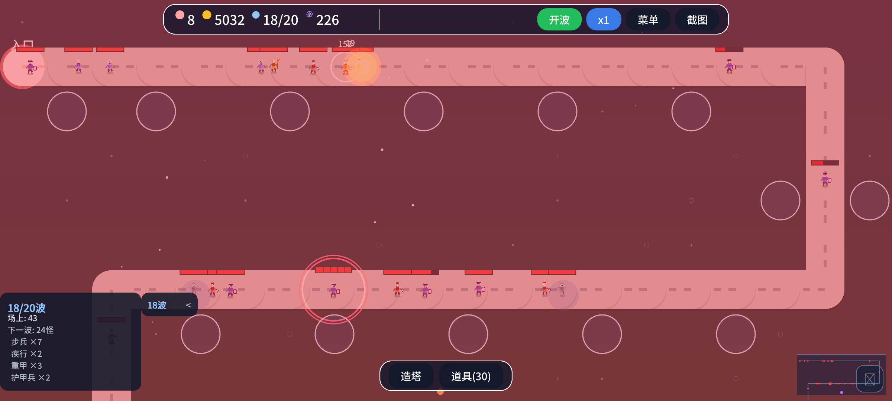

**检查项**:
1. 整体画面是否正常渲染（无全黑/全白/严重撕裂）？
2. UI 元素（顶栏、按钮）是否可见且布局正常？

### leak_wave_18_8289.png

**检查项**:
1. 整体画面是否正常渲染（无全黑/全白/严重撕裂）？
2. UI 元素（顶栏、按钮）是否可见且布局正常？

### leak_wave_18_8769.png
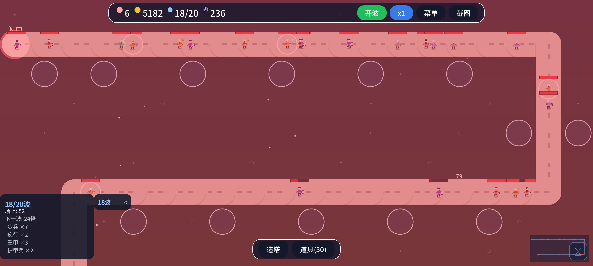

**检查项**:
1. 整体画面是否正常渲染（无全黑/全白/严重撕裂）？
2. UI 元素（顶栏、按钮）是否可见且布局正常？

### leak_wave_19_9180.png
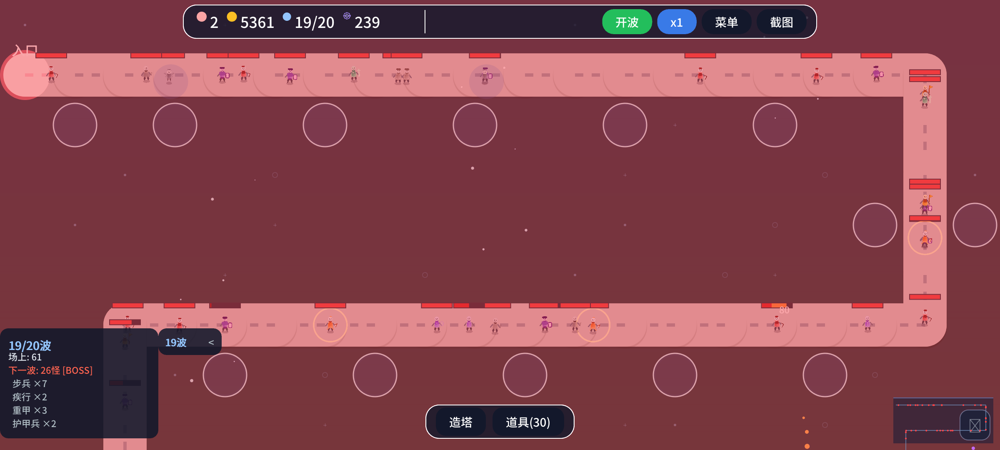

**检查项**:
1. 整体画面是否正常渲染（无全黑/全白/严重撕裂）？
2. UI 元素（顶栏、按钮）是否可见且布局正常？

### leak_wave_19_9433.png
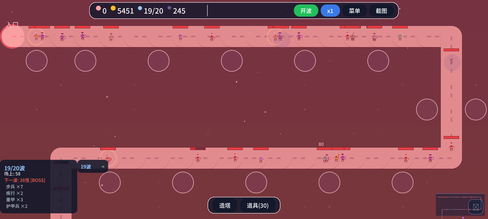

**检查项**:
1. 整体画面是否正常渲染（无全黑/全白/严重撕裂）？
2. UI 元素（顶栏、按钮）是否可见且布局正常？

